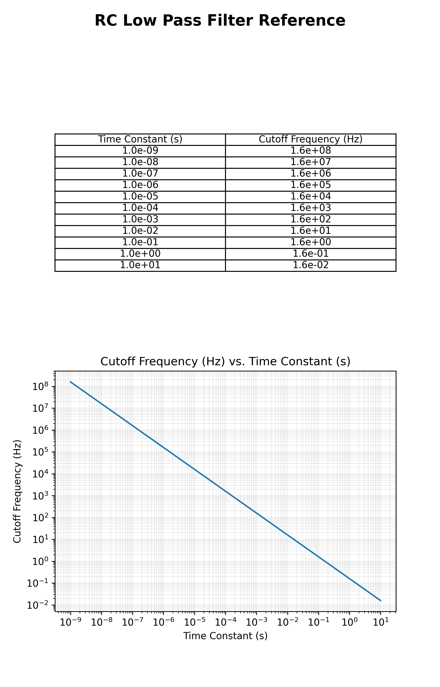

<h3> RC Low Pass Filter Design Reference </h3>
This is a graphic that was created to aid in basic RC low pass filter design. 
You can get a good idea of the cutoff frequency from only knowing 
the time constant and vice versa. This might save typing in an equation, and it
might also allow a visualization of the tradeoff between the two parameters.

